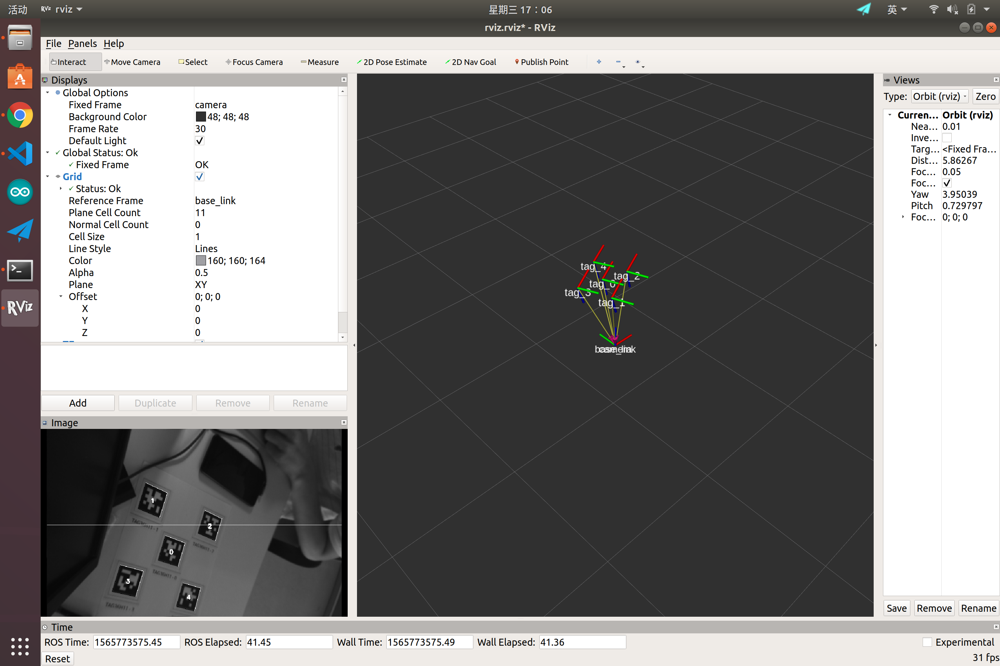
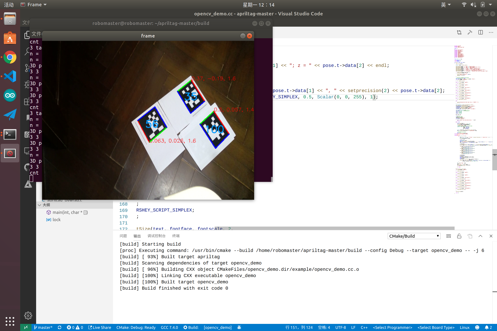
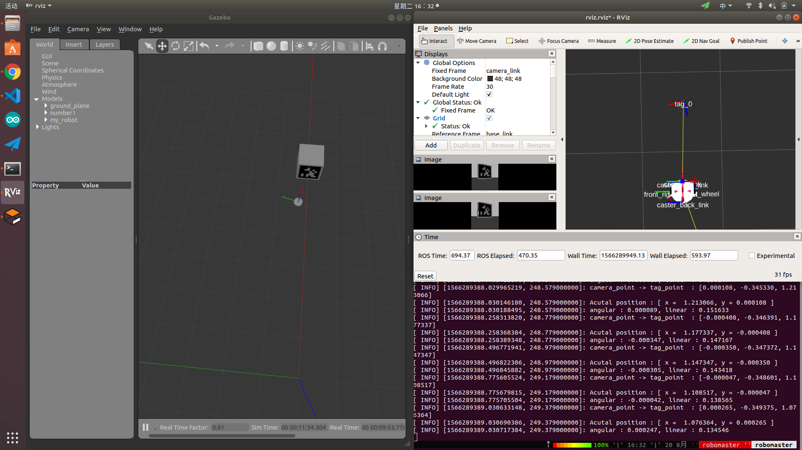
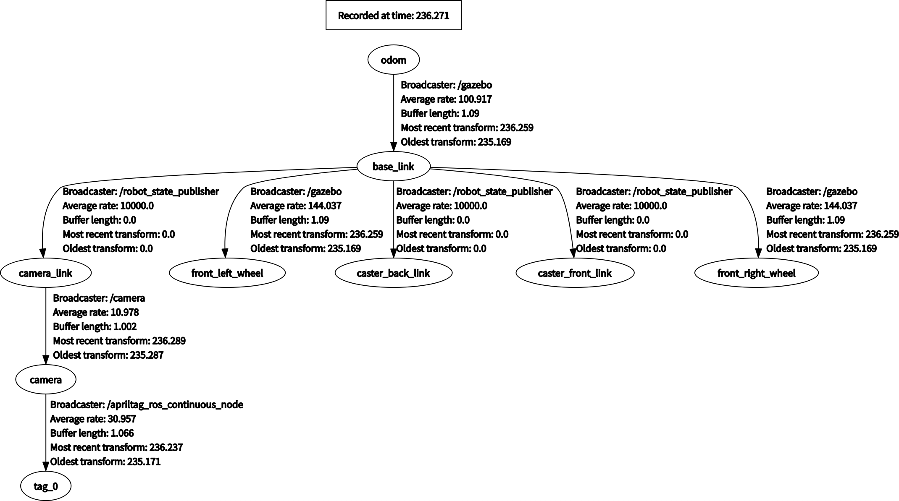

README
====

|Author|lifuguan|
|---|---
|E-mail|1002732355@qq.com


***

##  目录
* [基于AprilTag的ROS定位系统（摄像头型号 ：mvBlueFOX-MLC200wc）](#基于AprilTag的ROS定位系统（摄像头型号：mvBlueFOX-MLC200wc）)
* [直接通过apriltag+OpenCV（使用mp4或者其他USB摄像头）](#直接通过apriltag+OpenCV（使用mp4或者其他USB摄像头）)
* [Gazebo仿真环境下的Aprilag目标跟随](#Gazebo仿真环境下的Aprilag目标跟随)

### 基于AprilTag的ROS定位系统（摄像头型号：mvBlueFOX-MLC200wc）
---



### ！此摄像头不通用于普通USB摄像头（必须通过调用自带的SDK）
1. [SDK地址](https://www.matrix-vision.com/software-drivers-en.html)，敬请食用
2. 无法使用**OpenCV**中的`VideoCapture cap(0);`读取cam的信息
3. 无法使用**ROS**的*usb_cam*等常用包进行读取

## ROS调用简介


**bluefox2**

驱动摄像头，笔者的cam ID为 ： */mv_26806946*

**image_proc**

代入标定数据矫正frame ： */cam_id/image_raw*  -->  */cam_id/image_rect*

**apriltag_ros**

识别在`/config/tags.yml`里标记了的*tag*


## 使用方式(假设已经安装成功)

### 方法一

使用集成了的launch文件

``` bash
roslaunch apriltag_ros my_continuous_detection.launch
```

**注意**
需要自行修改`arg`中的`camera_name`


### 方法二

1. `roslaunch bluefox2 single_node.launch`
2. `ROS_NAMESPACE= your_cam_id rosrun image_proc image_proc`
3. `roslaunch apriltag_ros continuous_detection.launch`


### 直接通过apriltag+OpenCV（使用mp4或者其他USB摄像头）
---


### 源码地址 [opencv_demo.cc](/src/apritag/example/opencv_demo.cc)

## 使用方式

```bash
cmake . 
sudo make install
opencv_demo
```

## 相对于官方的修改

1. 增加**openmp**多线程处理 （此处修改了*CMakeLists.txt*）

2. 加入pose_estimation

3. 默认取消debug模式

### Gazebo仿真环境下的Aprilag目标跟随
---


- 包名称`apriltag_localization_simulations`
- 使用模型`car.urdf`

#### 使用步骤

```bash
roslaunch apriltag_localization_simulation gazebo_detect_simulation.launch

rosrun  apriltag_localization_simulation tag_tf_listener.cpp
```

**tag_tf_listener.cpp**

监听 */tag_0* 与 */camera* 之间的relative position，并转化成cmd_vel广播出去

**car.urdf**

tf树

